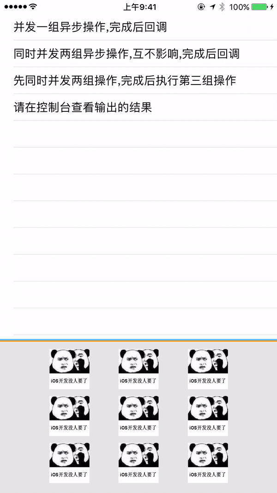
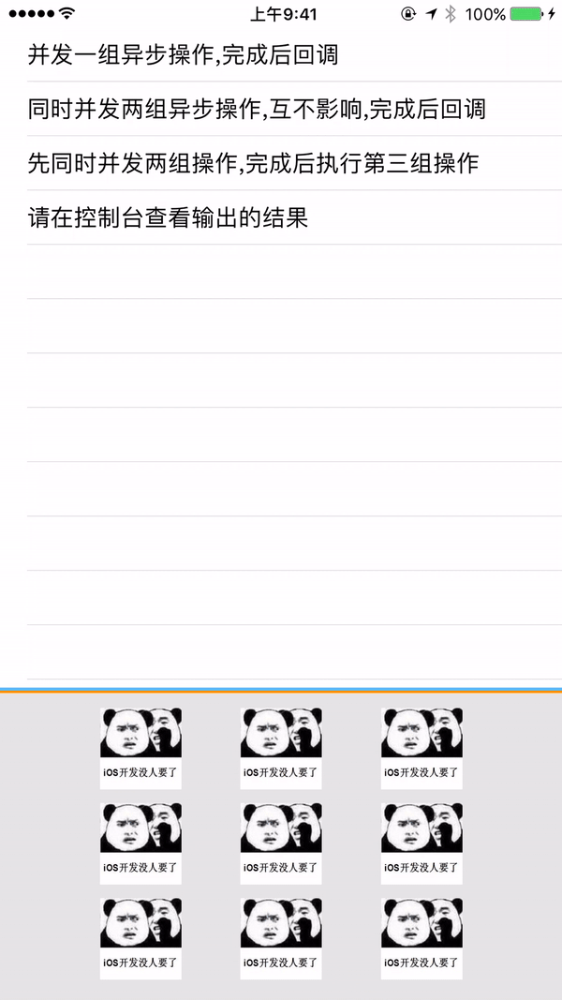
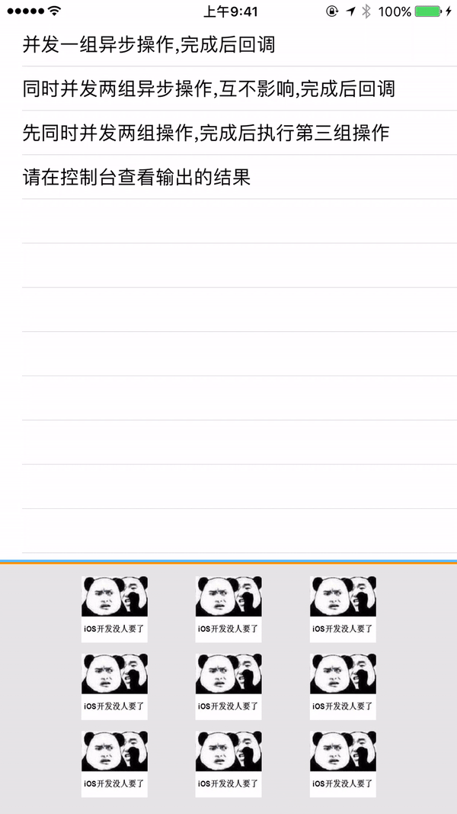

<p align="center" ><b><font size="8">iOS入门级攻城尸</font></b></p>
<p align="center" >
  
</p>


## 你有没有遇到过下面这些情况？
- 并发上传10张图片,上传完成后执行某些操作。
- 并发上传10张图片,同时并发上传10条语音,两项操作都完成之后执行某些操作。

- 如果你遇到了这种并发相关的需求,并且不想自己管理`GCD Group`或者是把`lock`打在`ViewController`里。那么这个库就是你所需要的。
- 你只需要简单的2-3步就可以安全的完成上述复杂并且危险的操作。

## Features

- [x] 线程安全:你可以在任意线程的任何时刻直接调用此框架!避免了切换线程和管理同步锁的麻烦
- [x] 内部使用`pthread_mutex_t`加锁,性能优异,几乎感觉不到资源消耗!
- [x] 使用分离锁结将锁的粒度缩小到每组并发一把锁!
- [x] 从不死锁!

## Installation
- 直接将`XYAsynchronizationManager`文件夹拖入项目中即可。

## How To Use

```
#import "XYAsynchronizationManager.h"
...
//1、设置总并发数量，并给这组并发设置一个唯一id
[[XYAsynchronizationManager sharedManager] xy_synchronizeWithIdentifier:@"oneGroup" totalCount:self.taskArray.count doneBlock:^{
    XYAM_Log(@"oneGroup Tasks Done!");
}];
...
[self.taskArray enumerateObjectsWithOptions:NSEnumerationConcurrent usingBlock:^(id  _Nonnull obj, NSUInteger idx, BOOL * _Nonnull stop) {
    dispatch_async(dispatch_get_global_queue(0, 0), ^{
        XYAM_Log(@"Task %@ executed", obj);

        //2、当你完成一步操作的时候，告知manager你完成了一步操作，你可以完全不考虑当前是在什么线程内，只需要直接调用即可。
        [[XYAsynchronizationManager sharedManager] xy_synchronizeOneStepByIdentifier:@"oneGroup"];
    });
}];
```

#### 单组并发操作
<p align="center" >
<br />

</p>
<br />
<br />

#### 同时并发两组异步操作,互不影响,完成之后回调。
<p align="center" >
<br />

</p>
<br />

#### 先同时并发两组操作,完成之后执行第三组操作。
<p align="center" >
<br />

</p>
<br />
<br />

## Communication
- 有任何问题欢迎加我的简书和微博讨论
- iOS入门级攻城尸的:[简书](http://www.jianshu.com/u/4c5a9f6f6831)、[微博](http://weibo.com/xuyang186)
- PS:兄弟我英语水平一般,本来想要把注释和文档都写成英文的，但是无奈怕自己写好多病句出丑。有没有英语好的小伙伴参与翻译一下。Orz
